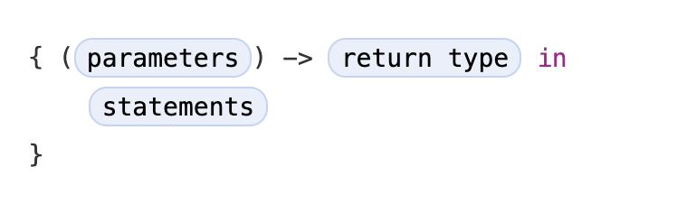

# Closure

Closures are self-contained blocks of functionality that can be passed around and used in your cod

### General syntax

---

    func calculator(n1: Int, n2: Int, operation: (Int, Int) -> Int) {
    		return operation (n1, n2)
    }
    
    func add(n1: Int, n2: Int) -> Int { return n1 + n2 }
    
    calculator(n1: 1, n2: 2, operation: add)

### Using closure for function calculator

Closure can dramatically simplify the code

    func calculator(n1: Int, n2: Int, operation: (Int, Int) -> Int) {
    		return operation (n1, n2)
    }
    
    calculator(n1: 1, n2: 2, operation: { (n1, n2: Int) -> Int in
     return n1 + n2 
    })
    
    // same function
    calculator(n1: 1, n2: 2, operation: { (n1, n2) in n1 + n2 })
    calculator(n1: 1, n2: 2, operation: { $0 + $1 })
    calculator(n1: 1, n2: 2, { $0 + $1 })  // Able to omit closure trailing at the end

### Closure with array

    let array = [ 1, 4, 5, 6 ]
    
    // using function
    func addOne(n: Int) -> Int { return n + 1 }
    array.map(addOne)
    
    // using closure
    array.map({ (n) in n + 1 })
    array.map({ $0 + 1 })
    
    // string interpolation
    array.map{"\($0)"}        // array elements are now strings

[Closures - The Swift Programming Language (Swift 5.2)](https://docs.swift.org/swift-book/LanguageGuide/Closures.html)