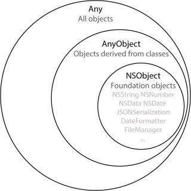

# Type Casting

```swift
class Animal {
	var name: String
	
	init(n: String) { name = n }
}

class Human: Animal {
	func talk() { ... }
}

class Fish: Animal {
	func breathUnderwater() { ... }
}
```

### is

---

```swift
let john = Human("John")
let Nemo = Fish("Nemo")

print(john is Human)    // true 
print(john is Fish)     // false
```

*is* statement is used for type checking

### as!

```swift
let john = Human("John")
let jane = Human("Jane")
let nemo = Fish("Nemo")
let animals = [john, jane, nemo]

for animal in animals {
	if animal is Fish {
		animal.breathUnderwater()    // error

		let fish = animal as! Fish
		fish.breathUnderwater()      // okay	
	}
}
```

as! turn something into subclass → Forced Downcast

### as?

```swift
if let fish = jane as! Fish { ... }   // Error

if let fish = jane as? Fish { ... }   // jane is not casted 
```

Cast to subclass when it actually can be casted

### as

```swift
let man = jack as Human
```

Cast to superclass (Upcast) → NO ERROR 

### Any, AnyObject, NSObject



Any: all objects

AnyObject: from classes

NSObject: from Foundation

```swift
let jack = Human("Jack")
let nemo = Fish("Nemo")
let num = 12

let things = [jack, nemo, num]           // Error: types are not same
let things: [Any] = [jack, nemo, num]    // Okay
let things: [AnyObjects] = [ ... ]       // Error: num is not from Class
let things: [NSObject] = [ ... ]         // Error: only num is from Foundation
```
